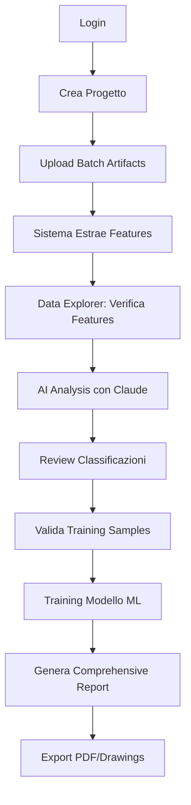

# BrozeAXE-AI: Guida Completa al Workflow

**Aggiornato:** 24 Novembre 2025
**Versione:** 1.0 con Autenticazione

---

## 📋 Indice
1. [Login e Autenticazione](#1-login-e-autenticazione)
2. [Upload Artifacts](#2-upload-artifacts)
3. [Estrazione Features](#3-estrazione-features)
4. [Navigazione Dati](#4-navigazione-dati-data-explorer)
5. [Analisi AI](#5-analisi-ai)
6. [Training ML Models](#6-training-ml-models)
7. [Generazione Report](#7-generazione-report)
8. [Workflow Completo End-to-End](#8-workflow-completo-end-to-end)

---

## 1. Login e Autenticazione

### 🔐 Accesso Sistema
**URL:** `http://localhost:5001/web/login`

**Credenziali Default:**
- **Username:** `admin`
- **Password:** `admin123`
- **Role:** Admin (accesso completo)

### Ruoli Utente
- **Admin:** Accesso completo, gestione utenti
- **Archaeologist:** Upload, analisi, classificazione
- **Viewer:** Solo visualizzazione (read-only)

### Endpoints User Management
- `GET /api/auth/users` - Lista utenti (admin only)
- `POST /api/auth/register` - Crea nuovo utente (admin only)
- `PUT /api/auth/users/<id>/role` - Cambia ruolo (admin only)

---

## 2. Upload Artifacts

### 📤 Upload Singolo
**URL:** `http://localhost:5001/web/upload`

**Processo:**
1. Seleziona file 3D (`.obj`, `.stl`, `.ply`)
2. Specifica Project ID (opzionale)
3. Click "Upload"
4. Il sistema:
   - Valida file (dimensione max: 100MB web, 500MB API)
   - Verifica integrità mesh con trimesh
   - Salva nel database
   - Estrae features automaticamente (36+ parametri)

### 📦 Upload Batch (Savignano)
**URL:** `http://localhost:5001/web/savignano-analysis`

**Processo:**
1. Seleziona multipli file 3D
2. Opzionale: Upload JSON pesi o DOCX note scansioni
3. Click "Upload Batch"
4. Sistema genera `analysis_id` univoco
5. Tutti i file vengono processati in batch

**API Endpoint:**
```bash
POST /api/savignano/upload-batch
Files: files[] (multiple)
Optional: weights_file (JSON), weights_docx (DOCX)
```

---

## 3. Estrazione Features

### 🔍 Features Automatiche
Dopo l'upload, il sistema estrae automaticamente:

**Morphometric Features:**
- Volume, surface area
- Length, width, thickness
- Centroid coordinates
- Curvature statistics
- Vertex/faces count

**Savignano-Specific Features (se applicabile):**
- Dimensioni ascia (lunghezza, larghezza, spessore)
- Peso stimato
- Simmetria bilaterale
- Curvatura lama
- Angolo filo
- Indice allungamento/appiattimento
- Rapporto lama/manico
- Profilo longitudinale/trasversale
- Compattezza forma
- Volume/peso specifico
- +26 altre features

### 📊 Dove Vedere le Features

**Opzione 1: Data Explorer**
```
http://localhost:5001/web/data-explorer
→ Artifacts tab
→ Click su artifact
→ Click "📐 Features"
```

**Opzione 2: API Endpoint**
```bash
GET /api/mesh/artifacts/<artifact_id>
```

Response:
```json
{
  "status": "success",
  "artifact": {
    "artifact_id": "axe_001",
    "features": {
      "volume": 5234.56,
      "length": 150.3,
      "width": 80.2,
      "savignano": {
        "lunghezza_ascia": 155.2,
        "peso_stimato": 450.8,
        ...
      }
    }
  }
}
```

---

## 4. Navigazione Dati (Data Explorer)

### 🗄️ Data Explorer Dashboard
**URL:** `http://localhost:5001/web/data-explorer`

**Sezioni:**

#### 📊 Overview
- Statistiche sistema (artifacts, classificazioni, training)
- Quick actions links
- System health

#### 🏺 Artifacts
- Lista paginata di tutti gli artifacts
- Ricerca per ID o filename
- Filtro per progetto
- Azioni:
  - 📐 View Features
  - 🗑️ Delete
- Pagination (20 items/pagina)

#### 📐 Features
- Visualizzazione dettagliata features estratte
- Morfometria + Savignano
- Valori numerici precisi

#### 🎯 Training Data
- Lista samples usati per training ML
- Artifacts con classificazione validata
- Gestione training set

#### 📄 Reports
- Links ai generatori di report
- Comprehensive report
- Technical drawings

#### 👥 Users (Admin Only)
- User management
- Cambio ruoli
- Attivazione/disattivazione utenti

---

## 5. Analisi AI

### 🤖 AI Analysis con Claude
Il sistema supporta analisi AI delle caratteristiche tecnologiche usando Claude API.

**URL:** `http://localhost:5001/web/savignano-comprehensive-report`

**Processo:**
1. Seleziona artifact da analizzare
2. Inserisci API Key di Anthropic (opzionale)
3. Sistema invia features a Claude 4.5
4. AI analizza:
   - Tecnica di produzione (fusione/martellatura)
   - Periodo cronologico
   - Area geografica probabile
   - Confronto con tipologie note
   - Raccomandazioni conservazione

**Output AI:**
```json
{
  "manufacturing_technique": "Lost-wax casting with cold hammering",
  "chronology": "Late Bronze Age (1200-1000 BCE)",
  "geographical_area": "Northern Italy, Po Valley",
  "typology": "Savignano-type flanged axe",
  "conservation_state": "Good, minor patina",
  "recommendations": [
    "Store in controlled humidity (45-55%)",
    "Avoid touching bronze surface",
    "Monitor patina development"
  ]
}
```

---

## 6. Training ML Models

### 🎯 Preparazione Training Data

**Step 1: Classificare Artifacts**
```bash
POST /api/classification/classify
{
  "artifact_id": "axe_001",
  "class_name": "Savignano Type A",
  "confidence": 0.95
}
```

**Step 2: Validare Classificazione**
- Archeologo verifica classificazione AI
- Marca come "validated" nel sistema
- Artifact diventa training sample

**Step 3: Gestire Training Samples**
```bash
GET /api/classification/training-samples
```

**Step 4: Training Modello**
- Sistema usa sklearn per training
- PCA per riduzione dimensionalità
- Clustering automatico (K-means, DBSCAN)
- Validazione cross-validation

### 📈 Workflow Training ML

```
1. Upload 50+ artifacts
   ↓
2. Estrazione features automatica
   ↓
3. Classificazione manuale/AI (validata da archeologo)
   ↓
4. Creazione training set (validated samples)
   ↓
5. Training modello ML (PCA + Classifier)
   ↓
6. Validazione su test set
   ↓
7. Deploy modello per classificazione automatica
```

---

## 7. Generazione Report

### 📊 Comprehensive Report
**URL:** `http://localhost:5001/web/savignano-comprehensive-report`

**Processo:**
1. Seleziona artifacts da analizzare
2. Configura parametri:
   - AI API key (opzionale)
   - Language (IT/EN/FR/DE/ES)
   - Include PCA/clustering
   - Include hammering analysis
   - Include casting analysis
3. Click "Generate Report"
4. Sistema genera PDF completo con:
   - **Analisi AI** (se API key fornita)
   - **PCA e Clustering** (grafico 2D/3D)
   - **Dendrogramma** (hierarchical clustering)
   - **Analisi Martellatura** (hammering patterns)
   - **Analisi Fusione** (casting marks detection)
   - **Visualizzazioni 3D**
   - **Tabella comparativa features**
   - **Statistiche descrittive**

### 📐 Technical Drawings
**URL:** `http://localhost:5001/web/savignano-drawings-test`

**Output:**
- Disegni tecnici 2D professionali
- Multiple viste (fronte, lato, top)
- Quote precise
- Export multilingua
- Formato pubblicazione scientifica

---

## 8. Workflow Completo End-to-End

### 🔄 Scenario 1: Nuovo Progetto Archeologico



### 📝 Esempio Pratico: Progetto Asce Savignano

**1. Setup (5 min)**
```bash
# Login come admin
http://localhost:5001/web/login
Username: admin / Password: admin123

# Crea progetto
POST /web/api/projects
{
  "project_id": "Savignano2025",
  "project_name": "Asce di Savignano",
  "description": "Comparazione Asce 3D"
}
```

**2. Upload Data (10 min)**
```bash
# Upload 7 asce in batch
http://localhost:5001/web/savignano-analysis
Files: axe_001.obj, axe_002.obj, ... axe_007.obj
```

**3. Esplora Dati (15 min)**
```bash
# Naviga al Data Explorer
http://localhost:5001/web/data-explorer

# Per ogni artifact:
# - Visualizza features estratte
# - Verifica qualità dati
# - Annota osservazioni
```

**4. Analisi AI (20 min)**
```bash
# Comprehensive Report con AI
http://localhost:5001/web/savignano-comprehensive-report

# Input:
# - Seleziona tutti 7 artifacts
# - Inserisci Claude API key
# - Language: Italian
# - Enable ALL analysis (PCA, hammering, casting)

# Output:
# - PDF 50+ pagine con analisi completa
```

**5. Training ML (opzionale, 30 min)**
```bash
# Se hai 20+ artifacts validati:
# 1. Vai a Data Explorer → Training
# 2. Verifica training samples disponibili
# 3. Lancia training automatico
# 4. Sistema crea modello classificatore
```

**6. Export e Pubblicazione (10 min)**
```bash
# Technical Drawings
http://localhost:5001/web/savignano-drawings-test
# → Export PDF disegni tecnici

# Comprehensive Report già generato
# → Download PDF dalla sezione Reports
```

---

## 🔌 API Endpoints Principali

### Autenticazione
```bash
POST /api/auth/login          # Login
POST /api/auth/register       # Crea utente (admin)
GET  /api/auth/users          # Lista utenti (admin)
GET  /api/auth/me             # Info utente corrente
```

### Artifacts
```bash
POST   /api/mesh/upload                # Upload singolo
GET    /api/mesh/artifacts             # Lista paginata
GET    /api/mesh/artifacts/<id>        # Dettagli + features
DELETE /api/mesh/artifacts/<id>        # Elimina artifact
```

### Savignano Analysis
```bash
POST /api/savignano/upload-batch       # Upload batch
POST /api/savignano/configure          # Config parametri
POST /api/savignano/run-analysis       # Esegui workflow
GET  /api/savignano/results/<id>       # Risultati
```

### Classification
```bash
POST /api/classification/classify      # Classifica artifact
GET  /api/classification/training-samples  # Lista training
POST /api/classification/train         # Training modello
```

### System
```bash
GET /api/system/health                 # Health check (pubblico)
GET /api/system/status                 # System stats (protetto)
GET /api/system/info                   # API info (pubblico)
```

---

## 🎯 User Management Specifico

### Endpoint Completo
```bash
# ATTENZIONE: User management è sotto /api/auth/ non /api/users/

# Lista utenti
GET /api/auth/users
Headers: Authorization: Bearer <token>
Response: {"users": [...]}

# Crea utente
POST /api/auth/register
Body: {
  "username": "archaeo1",
  "email": "arch@example.com",
  "password": "secure123",
  "full_name": "Mario Rossi",
  "role": "archaeologist"
}

# Cambia ruolo
PUT /api/auth/users/<user_id>/role
Body: {"role": "admin"}

# Elimina utente
DELETE /api/auth/users/<user_id>
```

---

## 🗂️ Database Schema Riferimento

### Tabella: artifacts
```sql
- artifact_id (PK)
- project_id (FK)
- filename
- file_path
- upload_date
- n_vertices
- n_faces
- volume
- surface_area
- is_watertight
- metadata (JSON)
```

### Tabella: features
```sql
- feature_id (PK)
- artifact_id (FK)
- feature_name
- feature_value
- extraction_date
```

### Tabella: stylistic_features
```sql
- id (PK)
- artifact_id (FK)
- feature_category (es. 'savignano')
- features_json (JSON completo)
- extraction_date
```

### Tabella: classifications
```sql
- classification_id (PK)
- artifact_id (FK)
- class_name
- confidence_score
- classification_date
- is_validated
- validator_notes
```

### Tabella: training_samples
```sql
- sample_id (PK)
- artifact_id (FK)
- class_label
- features_vector (JSON)
- validation_status
- added_date
```

---

## 📖 Domande Frequenti

### Q: Dove vedo i dati estratti dall'AI?
**A:**
1. Data Explorer → Artifacts → Seleziona artifact → Features
2. API: `GET /api/mesh/artifacts/<id>` include `features` object
3. Nel Comprehensive Report PDF (sezione AI Analysis)

### Q: Come uso le features per training ML?
**A:**
1. Classifica artifacts manualmente o con AI
2. Valida classificazioni (è corretta?)
3. Sistema marca come training samples
4. Training automatico quando hai 20+ samples validati
5. Modello usato per auto-classificazione nuovi artifacts

### Q: Come faccio comparazione tra artifacts?
**A:**
1. Data Explorer → Artifacts → Seleziona 2+ artifacts
2. Oppure: `/web/savignano-compare`
3. Sistema mostra side-by-side comparison
4. Include visualizzazioni grafiche differenze

### Q: Report generator dov'è?
**A:** Dashboard → Quick Actions → Data Explorer → Reports tab
O direttamente: `http://localhost:5001/web/savignano-comprehensive-report`

### Q: Posso esportare dati per analisi esterne?
**A:** Sì:
```bash
POST /api/mesh/export-features
Body: {"format": "csv"}  # o "json"
```

---

## 🚀 Best Practices

### Upload
- ✅ Usa nomi file significativi (`axe_savignano_001.obj`)
- ✅ Organizza per progetti
- ✅ Verifica mesh quality prima upload
- ❌ Non uploadare file corrotti o troppo grandi

### Classificazione
- ✅ Valida sempre classificazioni AI
- ✅ Aggiungi note archeologiche
- ✅ Usa nomenclatura consistente
- ❌ Non fidarti ciecamente AI senza validation

### Training
- ✅ Minimo 20 samples per classe
- ✅ Bilancia dataset (stesso numero per classe)
- ✅ Valida cross-validation scores
- ❌ Non trainare su samples non validati

### Report
- ✅ Genera dopo aver verificato features
- ✅ Includi AI analysis se possibile
- ✅ Usa language appropriato per pubblicazione
- ❌ Non generare report senza dati sufficienti

---

## 📞 Support

**Issues:** https://github.com/enzococca/BrozeAXE-AI/issues
**Documentation:** `/api/system/info`
**Health Check:** `/api/system/health`

---

**Version:** 1.0
**Last Update:** 2025-11-24
**Author:** BrozeAXE-AI Team
